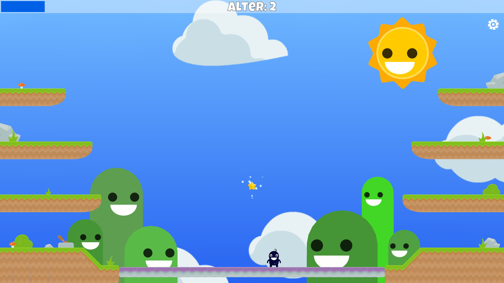

# Party Balance

   

A small unity game using the wii balance board (with [Wii Balance Walker](https://github.com/lshachar/WiiBalanceWalker/releases)) in combintion with the microphone. The game is a party game with one person playing through tilt and all the others controlling a bar through their cheer level.
